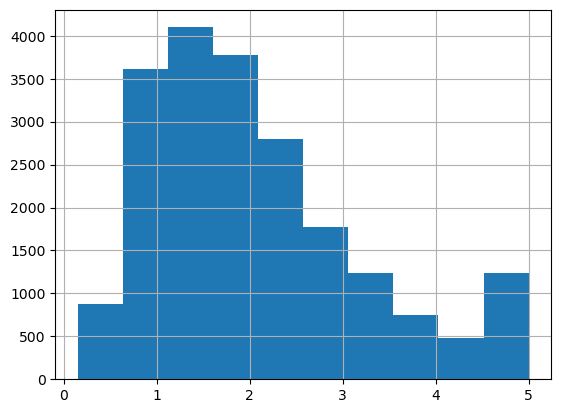
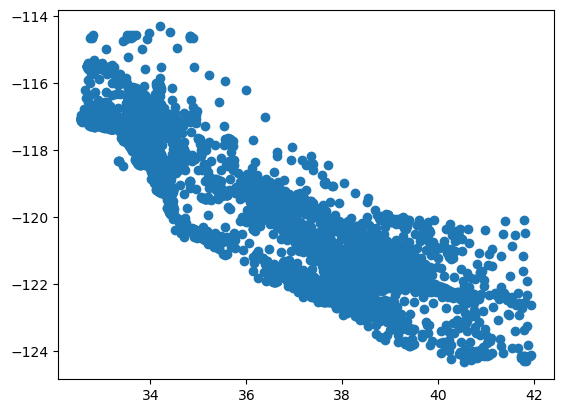

# Carlifornia Housing Prediction

## A regression problem


```python
import numpy as np
import matplotlib.pyplot as plt
import pandas as pd
import sklearn.datasets._california_housing as housing_data
```


```python
data = housing_data.fetch_california_housing(as_frame=True)
```


```python
df_housing = data['data']
df_housing.head()
```


<div>
<style scoped>
    .dataframe tbody tr th:only-of-type {
        vertical-align: middle;
    }

    .dataframe tbody tr th {
        vertical-align: top;
    }

    .dataframe thead th {
        text-align: right;
    }
</style>
<table border="1" class="dataframe">
  <thead>
    <tr style="text-align: right;">
      <th></th>
      <th>MedInc</th>
      <th>HouseAge</th>
      <th>AveRooms</th>
      <th>AveBedrms</th>
      <th>Population</th>
      <th>AveOccup</th>
      <th>Latitude</th>
      <th>Longitude</th>
    </tr>
  </thead>
  <tbody>
    <tr>
      <th>0</th>
      <td>8.3252</td>
      <td>41.0</td>
      <td>6.984127</td>
      <td>1.023810</td>
      <td>322.0</td>
      <td>2.555556</td>
      <td>37.88</td>
      <td>-122.23</td>
    </tr>
    <tr>
      <th>1</th>
      <td>8.3014</td>
      <td>21.0</td>
      <td>6.238137</td>
      <td>0.971880</td>
      <td>2401.0</td>
      <td>2.109842</td>
      <td>37.86</td>
      <td>-122.22</td>
    </tr>
    <tr>
      <th>2</th>
      <td>7.2574</td>
      <td>52.0</td>
      <td>8.288136</td>
      <td>1.073446</td>
      <td>496.0</td>
      <td>2.802260</td>
      <td>37.85</td>
      <td>-122.24</td>
    </tr>
    <tr>
      <th>3</th>
      <td>5.6431</td>
      <td>52.0</td>
      <td>5.817352</td>
      <td>1.073059</td>
      <td>558.0</td>
      <td>2.547945</td>
      <td>37.85</td>
      <td>-122.25</td>
    </tr>
    <tr>
      <th>4</th>
      <td>3.8462</td>
      <td>52.0</td>
      <td>6.281853</td>
      <td>1.081081</td>
      <td>565.0</td>
      <td>2.181467</td>
      <td>37.85</td>
      <td>-122.25</td>
    </tr>
  </tbody>
</table>
</div>


```python
df_housing.info()
```

    <class 'pandas.core.frame.DataFrame'>
    RangeIndex: 20640 entries, 0 to 20639
    Data columns (total 8 columns):
     #   Column      Non-Null Count  Dtype  
    ---  ------      --------------  -----  
     0   MedInc      20640 non-null  float64
     1   HouseAge    20640 non-null  float64
     2   AveRooms    20640 non-null  float64
     3   AveBedrms   20640 non-null  float64
     4   Population  20640 non-null  float64
     5   AveOccup    20640 non-null  float64
     6   Latitude    20640 non-null  float64
     7   Longitude   20640 non-null  float64
    dtypes: float64(8)
    memory usage: 1.3 MB


```python
medHouseValues = data['target']
medHouseValues
```


    0        4.526
    1        3.585
    2        3.521
    3        3.413
    4        3.422
             ...  
    20635    0.781
    20636    0.771
    20637    0.923
    20638    0.847
    20639    0.894
    Name: MedHouseVal, Length: 20640, dtype: float64


```python
medHouseValues.hist();
```


    

    


```python
plt.scatter(x=df_housing.Latitude, y=df_housing.Longitude);
```


    

    


```python
from sklearn.model_selection import train_test_split
```


```python
X_train, x_test, y_train, y_test = train_test_split(df_housing.values, medHouseValues.values, random_state=42, train_size=0.8)
```


```python
import sklearn.linear_model as linear
```


```python
model = linear.Ridge(alpha=0.5)
model.fit(X_train, y_train)
```


    Ridge(alpha=0.5)


```python
y_pred = model.predict(x_test)
```


```python
np.sqrt(sum((y_pred - y_test)**2))
```


    47.9013387924864


```python

```
